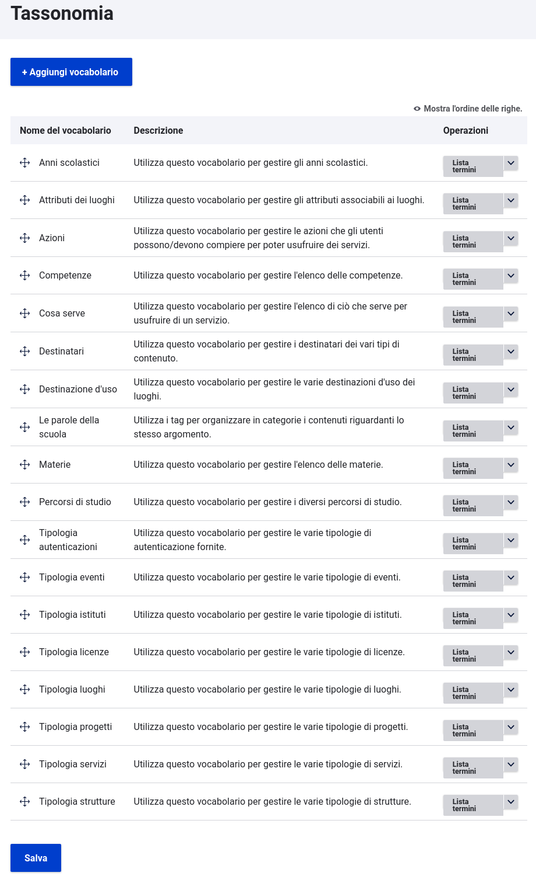

# Lexikà


[Lexikà](https://www.grecoantico.com/dizionario-greco-antico.php?parola=lexikon) è un modulo Drupal che installa i vocabolari utilizzati dalle scuole.
Lexikà, oltre ai vocabolari, importa le configurazioni degli url. 

## Requisiti
- Drupal: >= 10
- Profilo Drupal: `minimal`
- Moduli contrib: `pathauto`

## Installazione
Per aggiungere il modulo alla tua installazione esegui:
```
$ composer require drupal/pathauto ouitoulia/lexika
```
Installa il modulo `pathauto` e configuralo:
```
$ drush -y pm:install pathauto
$ drush -y config:set pathauto.settings punctuation.slash 1
```
Infine, installa Lexikà
```
$ drush -y en lexika
```

Questo è il risultato:



## Moduli consigliati
Per importare le voci di tassonomia nei vocabolari puoi usare: 
[Sunchronìzo lexikà](https://github.com/ouitoulia/sunchronizo_lexika)

## License

Copyright (C) 2023 https://github.com/ouitoulia

This program is free software: you can redistribute it and/or modify it under the terms of the GNU General Public License version 3 as published by the Free Software Foundation.

This program is distributed in the hope that it will be useful, but WITHOUT ANY WARRANTY; without even the implied warranty of MERCHANTABILITY or FITNESS FOR A PARTICULAR PURPOSE. See the GNU General Public License for more details.

Questo è un software libero: puoi ridistribuirlo e/o modificarlo secondo i termini della GNU General Public License versione 3 pubblicata dalla Free Software Foundation.

Questo programma è distribuito nella speranza che possa essere utile, ma SENZA ALCUNA GARANZIA; senza nemmeno la garanzia implicita di COMMERCIABILITÀ o IDONEITÀ PER UNO SCOPO PARTICOLARE. Vedere la GNU General Public License per maggiori dettagli.